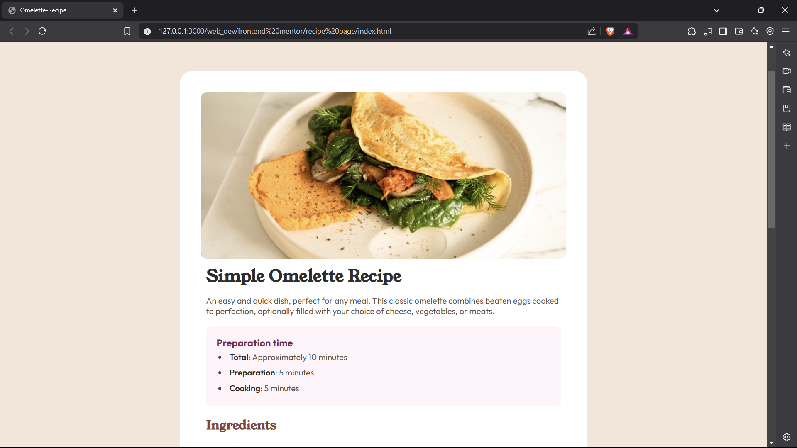

# Frontend Mentor - Recipe page solution

This is a solution to the [Recipe page challenge on Frontend Mentor](https://www.frontendmentor.io/challenges/recipe-page-KiTsR8QQKm).  

## Table of contents

- [Overview](#overview)
  - [The challenge](#the-challenge)
  - [Screenshot](#screenshot)
  - [Links](#links)
- [My process](#my-process)
  - [Built with](#built-with)
  - [What I learned](#what-i-learned)
  - [Continued development](#continued-development)
  - [Useful resources](#useful-resources)
- [Author](#author)

## Overview

### The-Challenge
The challenge was to create a static recipe page using html and css. The recipe page template was given.

### Screenshot

This is how the page will look in a large screen.
### Links

- Solution URL: [Github-repository](https://github.com/menukahansda/Omelette-Recipe)
- Live Site URL: [Github-pages](https://your-live-site-url.com)

## My process

### Built with

- Semantic HTML5 markup
- CSS custom properties

### What I learned

I learned that list bullets and their content can be styled differently. I also learned that when applied to a parent element, the properties justify-content and align-items affect its child elements.

### Continued development

Vertical and horizontal alignment have always been confusing to me. Going forward, I plan to learn more about them by using them in my future projects.

### Useful resources

- [Google fonts](https://www.example.com) - This helped me find the desired fonts. It offers a wide range of font families that you can incorporate into your project by embedding their links or importing them.

## Author
- Frontend Mentor - [@menukahansda](https://www.frontendmentor.io/profile/menukahansda)

